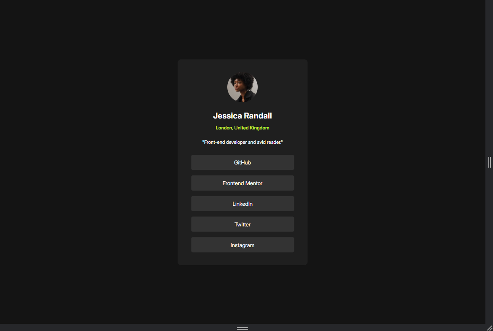
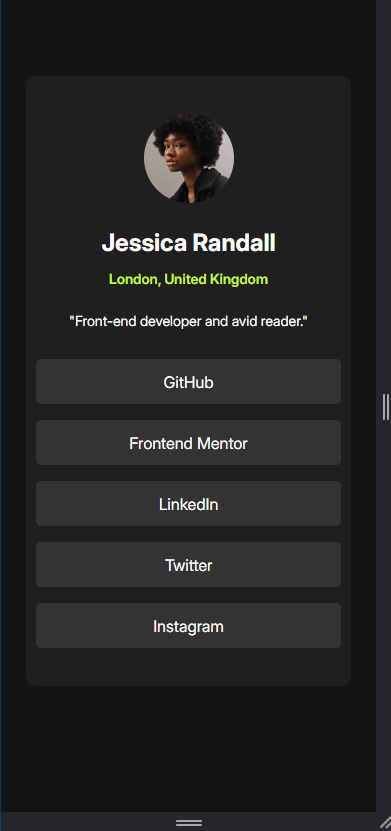

# Frontend Mentor - Social links profile solution

This is a solution to the [Social links profile challenge on Frontend Mentor](https://www.frontendmentor.io/challenges/social-links-profile-UG32l9m6dQ). Frontend Mentor challenges help you improve your coding skills by building realistic projects. 

## Table of contents

- [Overview](#overview)
  - [The challenge](#the-challenge)
  - [Screenshot](#screenshot)
  - [Links](#links)
- [My process](#my-process)
  - [Built with](#built-with)
  - [What I learned](#what-i-learned)
  - [Continued development](#continued-development)
  - [Useful resources](#useful-resources)
- [Author](#author)
- [Acknowledgments](#acknowledgments)

**Note: Delete this note and update the table of contents based on what sections you keep.**

## Overview

### The challenge

Users should be able to:

- See hover and focus states for all interactive elements on the page

### Screenshot




## My process

1. HTML Structure

The initial step in the development process involved structuring the HTML code to include all necessary elements. I utilized a <section> element inside the <body> to group the main content. Within this section, I added the following elements:

-An  tag to display the profile picture.
-An <h1> tag to showcase the profile name.
-An <h2> tag for the location (address).
-A <p> tag for the profile description.
-A <ul> (unordered list) containing five <li> (list items), each with an anchor <a> tag to link to the required social profiles.

2. Design Implementation with Figma

To ensure pixel-perfect alignment and dimensions, I imported the desktop design into Figma. This allowed me to accurately measure the widths, heights, and other necessary spacing for each element. By using Figma, I streamlined the process and maintained consistency throughout the development, significantly increasing the speed of completing this challenge.

3. Responsive Design

After finalizing the desktop layout, I implemented a responsive design approach. This was achieved by using a CSS media query that triggers when the screen width is 375px or less. Within this media query, I adjusted the section's width and added hover effects to enhance the user experience on smaller devices. This ensures that the design is fully responsive and accessible on mobile devices.

### Built with

-Semantic HTML5 markup
-CSS custom properties
-Flexbox
-Mobile-first workflow

### What I learned

During this project, I deepened my understanding of responsive design, particularly how to effectively use media queries to adapt layouts for smaller screens. Additionally, I refined my ability to utilize Figma for precise design measurements, which was instrumental in maintaining consistency across different devices.

To see how you can add code snippets, see below:

```html
<body>
  <section>
    
    <h1 class="inter">Jessica Randall</h1>
    <h2 class="inter">London, United Kingdom</h2>
    <p class="inter">"Front-end developer and avid reader."</p>
    <ul>
      <li class="inter"><a href="">GitHub</a></li>
      <li class="inter"><a href="">Frontend Mentor</a></li>
      <li class="inter"><a href="">LinkedIn</a></li>
      <li class="inter"><a href="">Twitter</a></li>
      <li class="inter"><a href="">Instagram</a></li>
    </ul>
  </section>
  <footer>
    <div class="attribution">
      Challenge by <a href="https://www.frontendmentor.io?ref=challenge" target="_blank">Frontend Mentor</a>. 
      Coded by <a href="#">Sotby</a>.
    </div>
  </footer>
</body>
```
```css
section li:hover{
    background-color: hsl(75, 94%, 57%);
    color: black;
    cursor: pointer;
    transition: 0.5s;
}
```

### Continued development

Moving forward, I plan to focus on further improving my skills in responsive design, particularly in creating layouts that work seamlessly across a broader range of devices and screen sizes. Additionally, I intend to explore more advanced CSS techniques and JavaScript frameworks to enhance the interactivity of future projects.


### Useful resources

- [CSS Tricks - A Guide to Flexbox](https://css-tricks.com/snippets/css/a-guide-to-flexbox/) - This guide helped me understand Flexbox better and how to apply it effectively in my project.
- [MDN Web Docs - Responsive Design](https://developer.mozilla.org/en-US/docs/Learn/CSS/CSS_layout/Responsive_Design) - This article provided a comprehensive overview of responsive design principles, which were crucial for this project.

## Author

- Frontend Mentor - [@Sotby](https://www.frontendmentor.io/profile/Sotby)
- Linkedin - (https://www.linkedin.com/in/gabriel-xavier-pereira-a3717123a)

